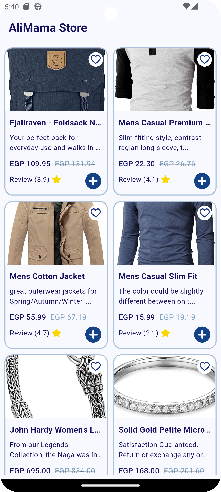

# 🛍️ AliMama Store

Welcome to AliMama Store, a sleek and modern Flutter app that brings the world of online shopping to your fingertips! Utilizing the Fake Store API, this app showcases a wide array of products in a visually appealing grid layout.

## ✨ Features

- 🚀 **Fast Loading**: Optimized performance for quick browsing
- 💎 **Sleek UI**: Beautiful, responsive design for an enhanced user experience
- 🔄 **Real-time Updates**: Stay current with the latest product offerings

## 📱 App Showcase

<table>
  <tr>
    <td></td>
    <td></td>
    <td></td>
  </tr>
  <tr>
    <td align="center"><strong>Loading Shimmer</strong></td>
    <td align="center"><strong>Home Screen</strong></td>
    <td align="center"><strong>Splash Screen</strong></td>
  </tr>
</table>

## 🛠️ Technologies Used

- **Flutter**: For building the cross-platform mobile application
- **Dart**: The programming language used with Flutter
- **Cubit**: For state management
- **http**: For making API requests
- **flutter_svg**: For rendering SVG icons
- **cached_network_image**: For efficient image loading and caching

## 🚀 Getting Started

To get started with AliMama Store, follow these simple steps:

1. Ensure you have Flutter installed on your machine.
2. Clone this repository:
   ```
   git clone https://github.com/yourusername/alimama-store.git
   ```
3. Navigate to the project directory:
   ```
   cd alimama-store
   ```
4. Install dependencies:
   ```
   flutter pub get
   ```
5. Run the app:
   ```
   flutter run
   ```

## 📚 Learn More

For more information on Flutter development:

- [Flutter Documentation](https://docs.flutter.dev/): Comprehensive guides and API reference
- [Flutter Cookbook](https://docs.flutter.dev/cookbook): Useful Flutter samples for common mobile development tasks
- [Dart Programming Language](https://dart.dev/): Learn more about the Dart language

## 📞 Contact

Built with ❤️ by Eslam Tarek Nabawy

- **LinkedIn**: [Eslam Tarek Nabawy](https://www.linkedin.com/in/eslam-tarek-nabawy/)
- **Email**: [eslamtarek.dev@gmail.com](mailto:eslamtarek.dev@gmail.com)

Feel free to reach out for any questions, suggestions, or collaboration opportunities!
